# CI/CD SpringBoot project tích hợp Jenkins

### 1. Cài đặt jenkins(Trên docker)
- **Giải thích** : Vì images jenkins măặc định chưa có docker, nên cần custom lại images jenkins tích hợp docker. Implement như sau:
- Tạo foler _jenkins_custom_images_
  + Trong folder _jenkins_custom_images_. Tạo  _Dockerfile_ như sau:
     ```
        FROM jenkins/jenkins
      
        USER root
      
        RUN curl -L \
        "https://github.com/docker/compose/releases/download/1.25.3/docker-compose-$(uname -s)-$(uname -m)" \
        -o /usr/local/bin/docker-compose \
        && chmod +x /usr/local/bin/docker-compose
      
        RUN curl -fsSL https://get.docker.com | sh
      
        USER jenkins
  + Tạo file _docker-compose.yml_ và cấu hình như sau:
     ```
    version: '2'
    services:
    jenkins:
    build:
    context: .
    dockerfile: Dockerfile
    hostname: jenkins
    container_name: jenkins
    restart: always
    privileged: true
    user: root
    ports:
    - 8083:8080
      - 50003:50000
    
          volumes:
            - D:\Workspace\docker-volume-data\jenkins-data:/var/jenkins_home
            - /var/run/docker.sock:/var/run/docker.sock
- Build custom images jenkins bằng lệnh sau : _docker build -t custom-jenkins ._
- Run container bằng lệnh sau : `docker-compose up`
- Kết quả:
   + 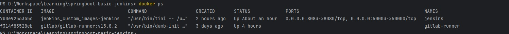
- Sau khi run container, truy cập _localhost:8083_ để vào jenkins
- Lấy token của jenkins : `docker logs jenkins_container_id`
    + 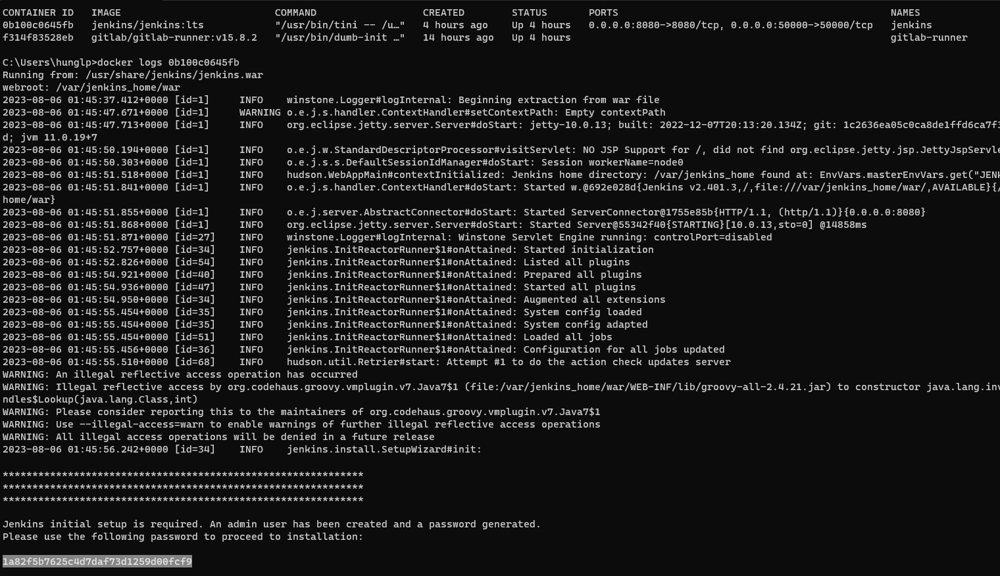
- Sau đó lấy token để nhập vào  hệ thống

### 3. Expose localhost Jenkins
- Cài đặt ngrok (App dùng để expose localhost jenkins ra một url khác trên internet để Github có thể truy cập được)
    + 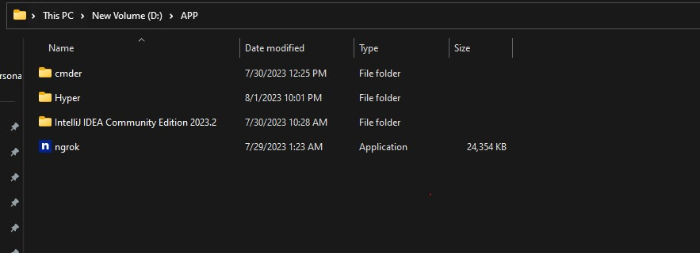
    + Chạy lệnh sau để expose : ngrok http 8080
    + 
### 3. Tích hợp Jenkins vào Github
- Tạo project trên github
- Vào Phần settings -> webhook, Nhập url `https://5293-1-55-219-115.ngrok-free.app/github-webhook/`
- 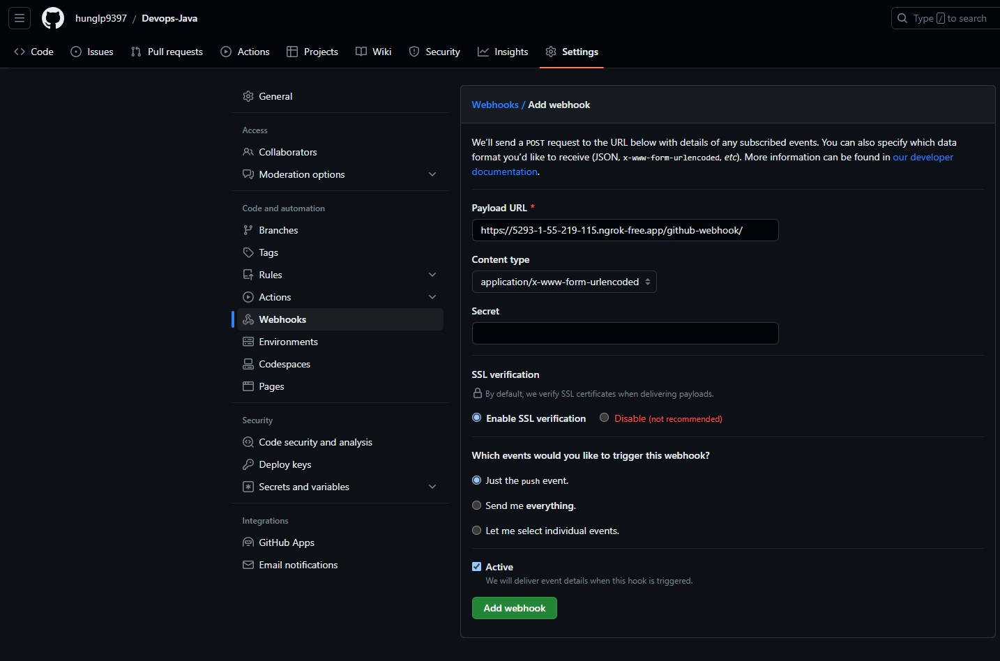
### 4. Tạo project trên Jenkins
- 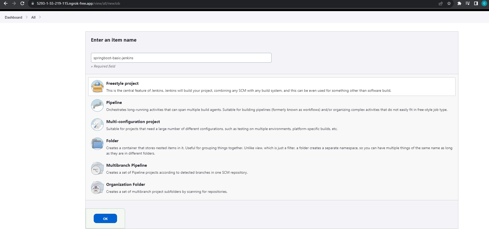
- 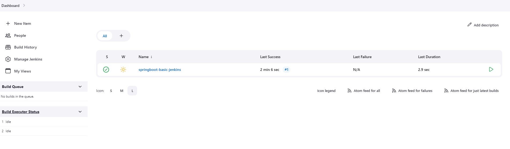
- Sau khi push code lên branch main thì jenkins bắt được events, và đây chính là event push:
    + 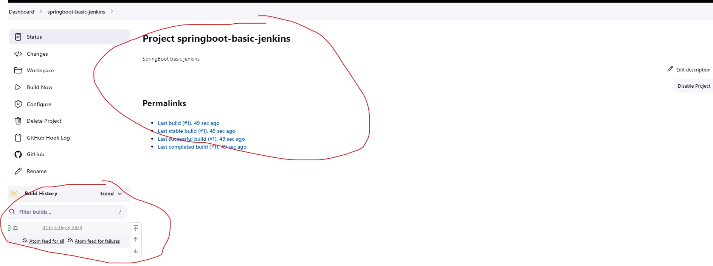
- **_Giải thích_**: Jenkins clone source code và đẩy vào thư mục _/var/jenkins_home/workspace/springboot-basic-jenkins_ trong jenkins containers
    + 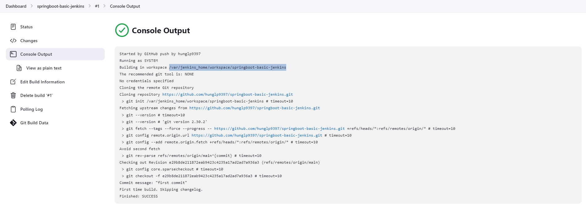
    +  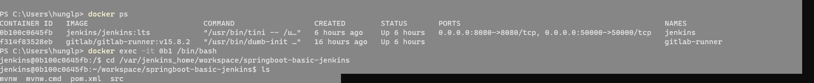
### 5. Tạo pipeline build : Sử dụng Jenkinsfile
- Trong thư mục gốc của project, tạo file Jenkinsfile, cấu hình stages và link github
- Trên dashboard cu jenkins localhost:8083, Chọn newItem -> Pipeline -> FreeStyle Project
- Cấu hình như sau:
  +  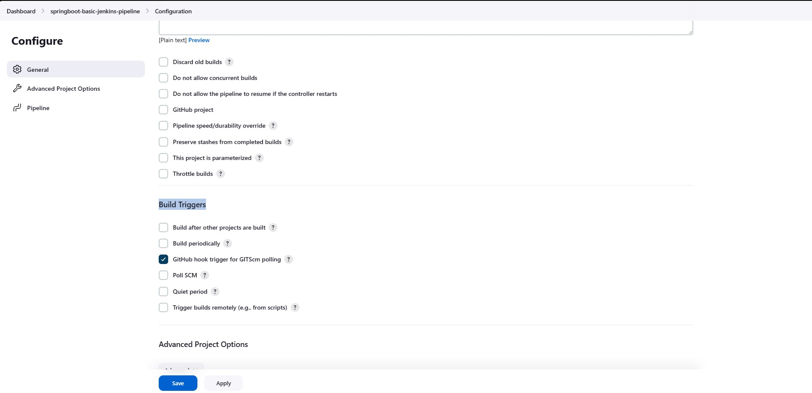
  + 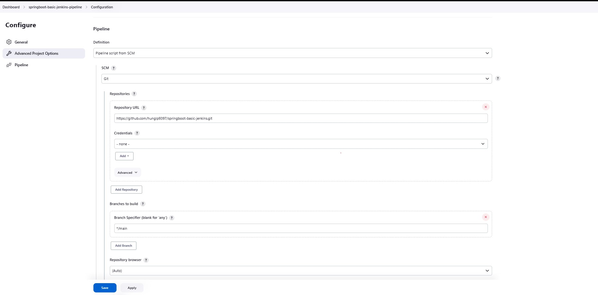
- Sau đó Chọn pipeline vừa taoj -> Chọn BuildNow ( Bước đầu tiền cần phải thực hiện manual, Các bước sau pipeline sẽ tự động thực thi các step trong file JenkinsFile)
  + 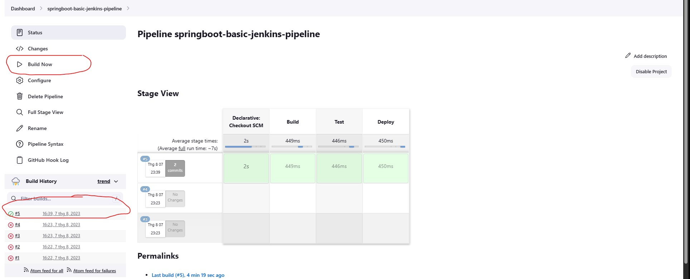
### 6. Install plugin:
- Trên dashboad, chọn Manage Jenkins -> Plugins  
- Install plugins sau : Docker Pipeline, Docker
### 7. Kiểm tra pipeline:
- Lưu ý : Lần đầu push code thì phải Build bằng tay ( _bấm vào Build Now_). Các lần sau mỗi khi push code lên sẽ tự động build
- Tại thời điểm thực thi bước này, Đang demo là chỉ build project ở stage Build
   + 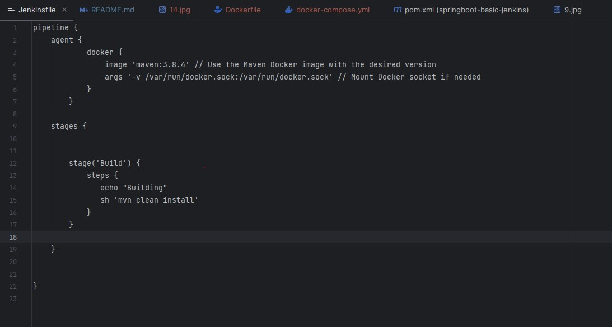
- Kết quả run pipeline:
  + 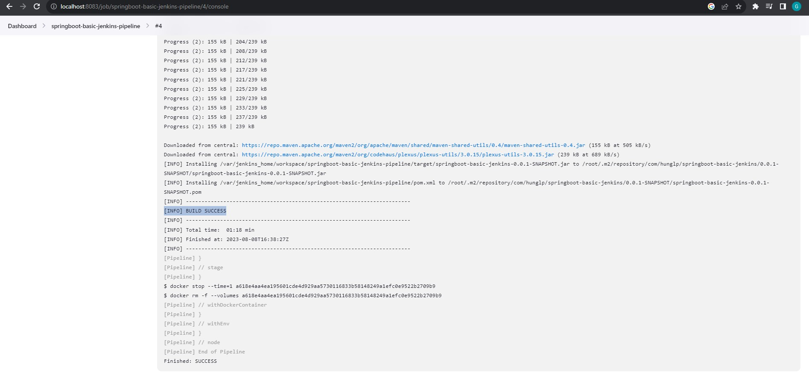
